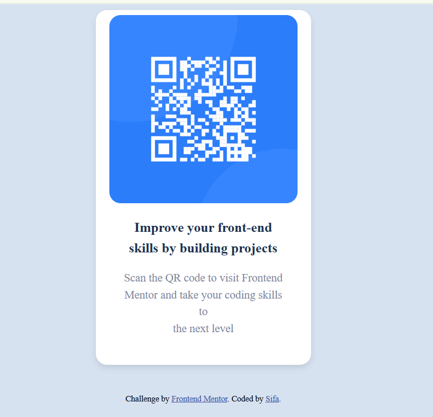

# Frontend Mentor - QR code component solution

This is a solution to the [QR code component challenge on Frontend Mentor](https://www.frontendmentor.io/challenges/qr-code-component-iux_sIO_H). Frontend Mentor challenges help you improve your coding skills by building realistic projects. 

## Table of contents

- [Overview](#overview)
  - [Screenshot](#screenshot)
  - [Links](#links)
- [My process](#my-process)
  - [Built with](#built-with)
  - [What I learned](#what-i-learned)
  - [Useful resources](#useful-resources)
- [Author](#author)


## Overview

### Screenshot



### Links

- Live Site URL: [Add live site URL here](https://your-live-site-url.com)

## My process

### Built with

- Semantic HTML5 markup
- CSS custom properties
- Flexbox
- CSS Grid
- Mobile-first workflow

### What I learned
Through this project, I gained valuable insights into:

**Centering Techniques:**
- Mastered using `flexbox` with `justify-content: center` and `align-items: center` for perfect centering
- Learned the importance of `min-height: 100vh` for full-viewport centering
- Discovered how `flex-direction: column` affects centering behavior

**Responsive Design:**
- Implemented width constraints with `max-width` for better mobile compatibility
- Used relative units (%) for images to maintain proportions
- Learned to balance fixed and fluid sizing for optimal responsiveness

**CSS Structure:**
- Improved my understanding of the box model through padding vs margin usage
- Practiced creating clean, maintainable CSS with proper class naming
- Learned to implement subtle shadows (`box-shadow`) for depth

**Debugging:**
- Discovered how browser developer tools help test responsiveness
- Learned to identify and fix common centering issues
- Gained experience troubleshooting CSS specificity problems


```html
<div class="container">
    <div class="image">
      
    </div> 
```
```css
.container{
      display: flex;
      flex-direction: column;
      align-items: center;
      justify-content: center;
      height: 80vh;
      width: 20vw;
      background-color: white;
      border-radius: 15px;
      padding: 15px;
      box-shadow: 0 4px 8px rgba(0, 0, 0, 0.1);
    }
```

### Continued development
 
Making the website responsive across different devices.

### Useful resources

- [Example resource 1](https://www.deepseek.com) - This helped to debug my code

## Author

- Frontend Mentor - [@yourusername](https://www.frontendmentor.io/profile/Sifa001)
